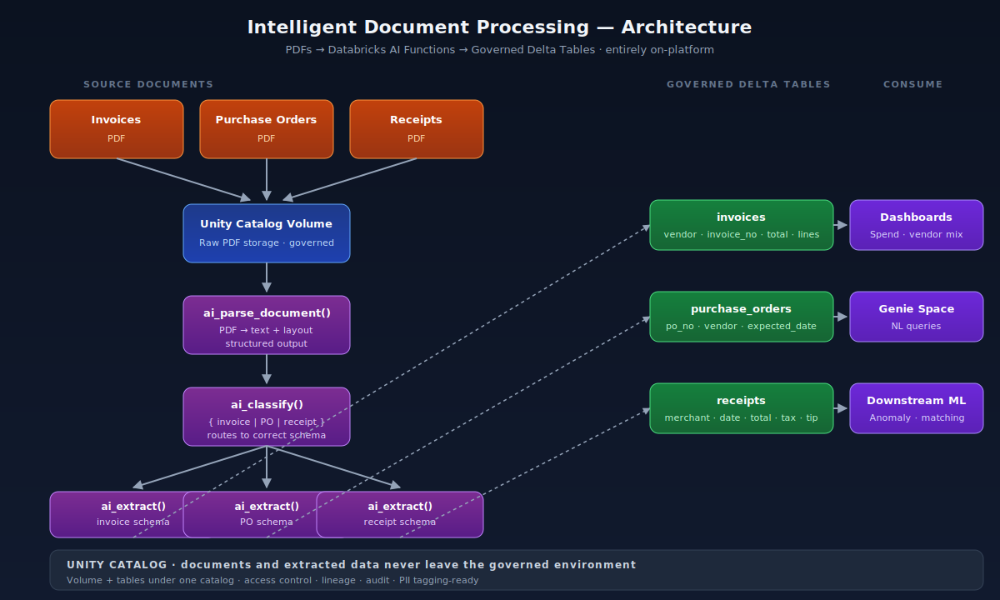

# Intelligent Document Processing on Databricks (GenAI-native)

> Automated extraction of structured data from invoices, purchase orders, and receipts — built entirely on Databricks using native AI functions (`ai_parse_document`, `ai_classify`, `ai_extract`), landing into governed Unity Catalog Delta tables.



---

## The business problem

Almost every mid-sized business drowns in unstructured business documents:

- **Accounts Payable** keys invoice line items into the ERP by hand.
- **Procurement** matches purchase orders against received goods manually.
- **Finance** reconciles receipts and expenses across email, paper, and PDFs.

Traditional OCR + rules-based extraction is brittle, vendor-locked, and expensive to maintain. Modern alternatives typically require shipping documents off-platform to a third-party API — which raises governance, cost, and lineage concerns.

**This project shows the entire IDP workflow running natively inside Databricks** — meaning the documents never leave the customer's governed environment, and the extracted data lands directly in the same Lakehouse that powers their analytics and ML.

## What this project does

A repeatable pipeline that, for any new business document landed in a Databricks Volume:

1. **Parses** the PDF using `ai_parse_document` — produces structured text + layout metadata.
2. **Classifies** it as `invoice`, `purchase_order`, or `receipt` using `ai_classify`.
3. **Extracts** the right fields per document type using `ai_extract` (e.g., vendor, invoice number, line items, totals, dates).
4. **Loads** the structured output into the appropriate **Delta table** in Unity Catalog — `invoices`, `purchase_orders`, `receipts`.
5. From there, the data is immediately queryable via SQL, BI dashboards, or a **Genie space** for natural-language questions like *"What did we spend with Vendor X last quarter?"*

## Architecture


```
PDF Documents ──► Unity Catalog Volume
                         │
                         ▼
                  ai_parse_document   ←─ extract text + structure from PDF
                         │
                         ▼
                    ai_classify       ←─ {invoice | purchase_order | receipt}
                         │
              ┌──────────┼──────────┐
              ▼          ▼          ▼
          ai_extract  ai_extract  ai_extract
          (invoice    (PO         (receipt
           schema)     schema)     schema)
              │          │          │
              ▼          ▼          ▼
         invoices    purchase_   receipts
         (Delta)     orders      (Delta)
                     (Delta)
              └──────────┬──────────┘
                         ▼
              Dashboards · Genie · Downstream ML
```

## Why this matters

| Approach | Data leaves customer environment? | Governance | Cost predictability | Vendor lock |
|---|---|---|---|---|
| Traditional OCR + rules | No | Manual | Predictable but high TCO | Medium |
| Third-party IDP SaaS | **Yes** | External | Per-document fees | High |
| **Databricks-native (this project)** | **No** | **Unity Catalog end-to-end** | **DBU-based, observable** | **Low** |

For regulated industries — healthcare, finance, public sector — keeping documents inside a governed Lakehouse isn't a nice-to-have, it's the deciding factor.

## Tech stack

| Layer | Technology |
|---|---|
| Compute | Databricks Serverless SQL Warehouse |
| Storage | Unity Catalog Volume (raw PDFs) + Delta Lake (extracted data) |
| AI / Extraction | `ai_parse_document`, `ai_classify`, `ai_extract` (Databricks AI Functions) |
| Orchestration | Databricks SQL Notebooks (extensible to Workflows / DLT) |
| Governance | Unity Catalog (volume + schema + table-level grants) |
| Sample documents | Synthetic / public-domain invoices, POs, receipts |

## Repository structure

```
databricks-idp-genai/
├── README.md
├── LICENSE
├── docs/
│   ├── architecture.png
│   ├── pipeline-flow.png
│   └── ai-functions-comparison.md
├── sample_documents/
│   ├── invoices
│   ├── purchase_orders
│   └── receipts
├── notebooks/
│   ├── idp_pipeline.sql.ipynb
├── sql/
│   └── ddl/
│       ├── invoices.sql
│       ├── purchase_orders.sql
│       └── receipts.sql
└── screenshots/
    ├── parse_output.jpeg
    ├── classify_output.jpeg
    └── final_tables.jpeg
```

## Key design decisions & trade-offs

- **Native AI functions over an external LLM API.** `ai_parse_document` / `ai_classify` / `ai_extract` keep documents inside the governed environment, give predictable DBU-based costs, and benefit from Databricks' own optimization. The trade-off: you accept the function set Databricks ships, rather than custom prompt engineering against a frontier model.
- **Classify before extract, not single-shot extraction.** A two-stage pipeline (classify → extract per type) is more accurate and far easier to debug than asking a single prompt to handle three document types at once. It also makes adding a fourth document type a contained change.
- **Schema per document type.** Each output table has the columns that document type actually has — invoices get line items, receipts get tip and tax, POs get expected delivery dates. Forcing a unified schema would have meant an unmanageable wide table with mostly NULLs.
- **Delta tables, not views over the raw parse output.** Materialized tables make the downstream BI / ML work fast and decoupled from the parse step.

## What I would add for a production deployment

- **Workflow orchestration** — wrap the notebooks in a Databricks Workflow with a file-arrival trigger on the volume.
- **Delta Live Tables** — express the parse → classify → extract → land pipeline declaratively, with data-quality expectations on the extracted fields.
- **Confidence scoring + human-in-the-loop** — route low-confidence extractions to a review queue (e.g., a small Databricks App).
- **Lakehouse Monitoring** on the output tables to track extraction drift over time.
- **Vendor master data join** — enrich the extracted vendor name against a vendor master table to catch new vendors and typos.
- **Genie space** on top of the three tables for natural-language queries by AP and procurement teams.
- **Lineage and PII handling** via Unity Catalog tags on sensitive columns.

## How to reproduce this

1. Clone the repo into your Databricks workspace (or import the notebook files).
2. Create the catalog, schema, and volumes.
3. Upload the sample PDFs (provided here) into the volume (or use your own).
4. Run `notebooks/idp_pipeline.sql.ipynb for full transformation pipeline.
5. Verify the three Delta tables (`invoices`, `purchase_orders`, `receipts`) are populated with extracted data.
6. (Optional) Build a Lakeview dashboard or Genie space on top of the tables.

Tested on Databricks Free Edition with a Serverless Starter Warehouse.

## Sample output

Look at screenshots folder for Parsed, classified and final table outputs.

## Lessons learned

_Lesson 1: Classify first, then extract — not the other way around._
My initial instinct was to try a single-shot approach: pass each document to ai_extract with a universal schema covering all possible fields (vendor, invoice number, PO number, receipt number, merchant, etc.) and sort out what came back. This was messy — the model would hallucinate fields that didn't exist in the document, or map the wrong value to the wrong field (e.g., pulling a receipt's transaction date into the invoice_date column). Splitting the pipeline into classify-then-extract, with a tailored field list per document type, was significantly more accurate and far easier to debug. It also means adding a fourth document type (say, credit notes) is a contained change — one new WHERE clause and one new ai_extract call — rather than a rework of a fragile universal schema.

_Lesson 2: The parsing step matters more than the AI steps._
I spent most of my time tuning the ai_classify and ai_extract prompts, but the single biggest factor in extraction quality turned out to be how well ai_parse_document structured the raw PDF in the first place. The transform + coalesce + concat_ws flattening step (converting the nested elements array into clean doc_text) was where the real work happened. When the flattened text was clean and well-ordered, classification and extraction worked almost perfectly. 

## About me

I'm a Data Architect / Engineer based in Utrecht, NL, focused on GenAI-native data platforms — turning unstructured business content into governed, analytics-ready data inside the Lakehouse. Available for contract and consulting engagements.

💼 **[LinkedIn]({[your LinkedIn URL](https://www.linkedin.com/in/sudhirsinghkumar/)})**
